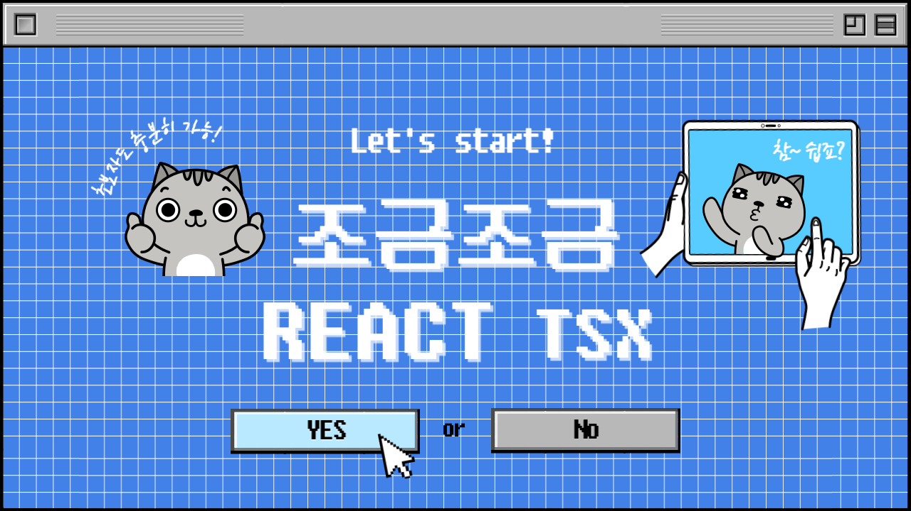
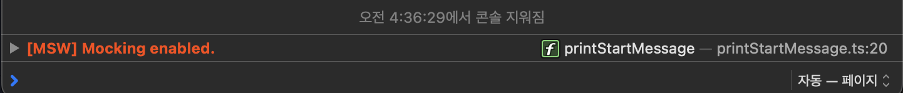
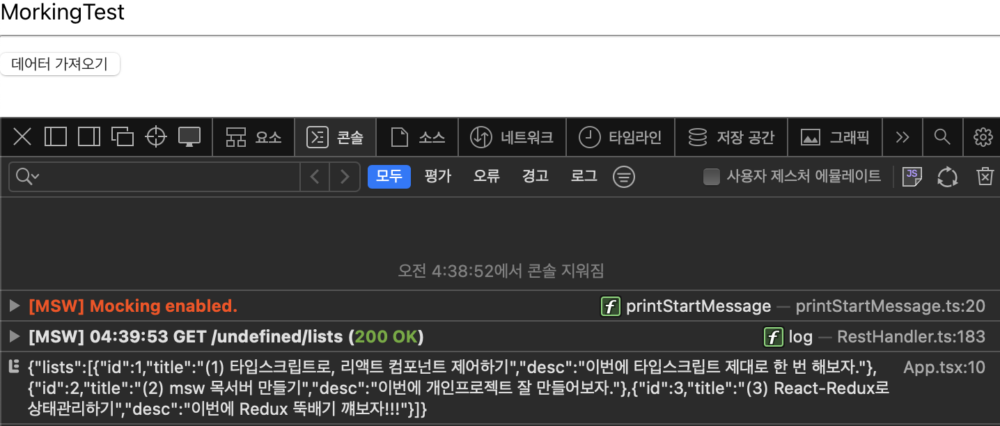
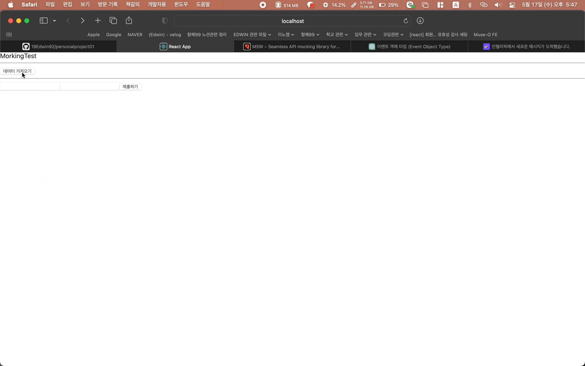
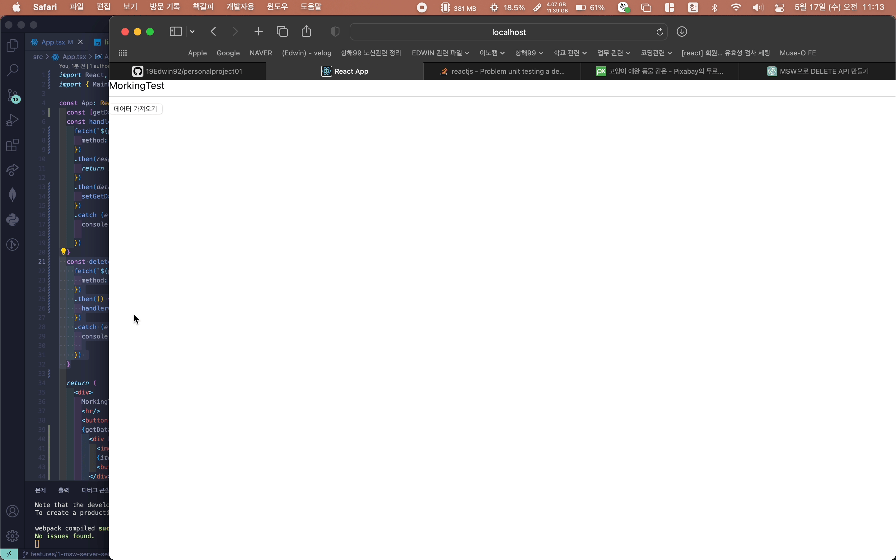

<div align="center"></div>

<br/>
<br/>

# First Edwin Project
## 💡 프로젝트개요 
이번 개인프로젝트의 목표는 먼저 tsx 구문으로 리액트 컴포넌트를 연습하는 것이며, 다음으로 msw를 통해서 프론트엔드 테스트코드를 구현하는 것이고, 셋째로 Redux-ThunkAPI를 통해서 전역상태관리를 하는 것이다. 
<br/><br/>
<details>
<summary>첫째, 타입스크립트로 리액트 컴포넌트 작성하기 </summary>
타입스크립트를 도입하는 이유는 컴파일 단게에서 리소스를 제어하기 위함이다. 이를 통해서 코드의 안정성을 높이고자 한다. 예상치 못한 상황에서 발생되는 리소스 에러를 빌드 후 확인하는 것이 아니라, 컴파일 단계에서 확인하며 꼼꼼하게 코드를 작성하는 것은 중요하기 때문이다. 
<hr>
</details>

<details>
<summary>둘째, msw라이브러리로 API 호출, 목데이터에 접근하기</summary>
프론트 개발에 있어서 msw(Mock Service Worker) 라이브러리를 적용하는 것은 목데이터를 활용하여 API콜을 서버가 구축되기 이전에 테스트하고자 함에 있다. 이를 통해서 서버개발이 구축되기 전에 코드를 작성하는 것이 가능하다.<br/><br/>

- Mock Service Worker 라이브러리 <br/>
  네트워트의 요청을 가로채고, 가짜 응답을 제공하여 실제 서버와 독립적으로 작업할 수 있는 환경을 제공한다. 이를 통해서 개발자는 목데이터를 활용하여 특정 엔드포인트에 대한 응답을 정의하고, 실제 API호출 없이 응답을 받아올 수 있다. "msw"의 특별한 점은 네트워크 요청을 가로채는 방식을 사용한다는 것이다. 이를 통해 애플리케이션의 실제 코드를 변경하지 않고도 API 호출을 가로채고 조작할 수 있다. 또한, "msw"는 강력한 요청 및 응답 핸들링 기능을 제공하므로 다양한 시나리오를 모방하고 테스트할 수 있다. 즉 "msw"는 개발자가 임시로 모의 데이터를 사용하거나, 백엔드 서버가 아직 준비되지 않았을 때도 애플리케이션의 API 호출을 테스트하고 개발할 수 있는 유용한 도구인 셈이다.
- json-server 라이브러리 <br/>
  실제 백엔드 서버와는 별개로 동작하는 가상의 RESTful API 서버를 만들어주는 도구이다. JSON 파일이나 JavaScript 객체로부터 데이터를 읽어와서 해당 데이터를 기반으로 가짜 API를 생성할 수 있다.
- 용어정리 <br/>
  엔드포인트(Endpoint) : 웹 API에서 특정 리소스에 접근하기 위한 URL 경로를 말한다.
- 라이브러리 사용하기 <br/>
  첫째, src -> mock 폴더를 생성<br/>
  둘째, browser.ts 파일과 handlers.ts 파일 만들기<br/>
  셋째, [msw 서버열기](https://mswjs.io/docs/getting-started/integrate/browser)<br/>
   - `터미널에 명령` :  yarn msw init public/ --save
   - `터미널에 성공메시지 확인하기` : Service Worker successfully created!
   - `index.tsx`에 아래의 코드 넣이주기<br/><br/>

      ```tsx
      // Start the mocking conditionally.
      if (process.env.NODE_ENV === 'development') {
        const { worker } = require('./mork/browser')
        worker.start()
      }
      ```
  
      <br/><br/>
  - `msw 실행`하여 data를 불러와보자. 
  <br/><br/>
  <br/><br/>

  - `msw` DELETE, POST까지 기능을 구현했다.(fetchAPI)<br/><br/>
  <br/><br/>

  - `msw` CRUD 기능구현 완료.(fetchAPI)<br/><br/>
        
<hr>
</div>
</details>

<details>
<summary>셋째, Redux-ThunkAPI로 상태관리 하기 </summary>
  항해99-13기를 이수하며 React-query와 Recoil에 대해서는 충분한 연습을 한 것 같다. 그러나 사실 Redux에 대해서는 todoLists만 작성해 보았지 그 이상을 도전하지는 못했다. 이번 프로젝트는 Redux 라이브러리를 연습하는 것을 목표로 삼고자 한다. 
<hr>
</details>
<br/>

## 🕰 프로젝트 개발기간
- 2023.05.17(수)

<br/>

## ⚙️ 라이브러리 
라이브러리 | 설명
---|:---
 | 목데이터를 활용한 가짜서버(API) 만들기
 | 프로미스를 기반으로 한 API 호출 라이브러리

<br/>

## 🔬 트러블이슈
<details>
<summary>첫째, msw라이브러리의 타입정의</summary>

  - `공식문서` : 공식문서에서는 찾아볼 수 없고 https://github.com/mswjs/msw/blob/main/test/browser/rest-api/basic.mocks.ts 을 통해서 해당 내용에 접근할 수 있는 것 같다. MSW 라이브러리의 GitHub 저장소는 다양한 문서와 예제를 제공하는데, 이를 통해서 볼 때 별도의 타입설정을 여기서는 하지 않는 것 같다. 

  - `타입단언` : delete 호출을 구현하려는 가운데 문제가 발생했다. 명시적 타입을 선언해주지 않은 결과, 실행된 타입추론이 문제가 되었다. 마우스를 올려보면 `const id: string | readonly string[]`으로 타입이 추론된 것으 볼 수 있다. 이는 req.params.id의 타입이 타입 시스템이 확실히 인지하지 못하기 때문이다. 단일하면 string이지만, 여러 값일 때는 배열로 처리되도록 인지했기 때문이다. 그러기에 개발자가 타입을 확신할 수 있다면 `as`(타입단언)을 통해서 타입을 명시적으로 선언함으로 타입 시스템을 우회할 수 있다. 그러나 GPT에 따르면 타입 단언은 타입 안정성을 잃을 수 있는 문제를 가지고 있기에 대안적인 방법(타입가드, 타입변환함수)로 접근하는 방법이 더 나은 방법이라고 한다. 해당 부분은 오늘 수업을 들을 부분이기에 추후에 적용하도록 하자.<br/>
      ```tsx
      // 문제의 타입 추론(req.params.id)
      // 에러메시지 : string | readonly string[]' 형식의 인수는 'string' 형식의 매개 변수에 할당될 수 없습니다.  'readonly string[]' 형식은 'string' 형식에 할당할 수 없습니다.ts(2345) 

      rest.delete(`${process.env.REACT_SERVER_KEY}/lists/:id`, async (req, res, ctx) => {
        const id = req.params.id as string;
        if (id) {
          const listsIndex = lists.findIndex(items => items.id === parseInt(id));
        }
        return res(ctx.status(200));
      })
      ```

<hr>
</details>

<details>
<summary>둘째, delete호출(msw)과 관련하여 데이터가 업데이트 되지 않는 이슈</summary>

  - `데이터의 동기화` : 현재 get 방식으로 가져온 자료는 useState에 의해서 관리받고 있다. 그리고 결과 msw의 값은 변경되지만, 해당 내용이 즉시 반영되지 못하는 이슈가 있었다. 당연하다. delete에 따른 서버데이터를 반영하지 못한 결과이다. 그래서 GPT에 물어봤지만, 역시 그 녀석은 원하는 바를 곧잘 말해주지 않는다. <br/><br/>
    ```tsx
    const deleteHandler = (id:number) => {
      fetch(`${process.env.REACT_SERVER_KEY}/lists/${id}`, {
      method: 'DELETE'
      })
      .then(() => {
      const updatedLists = getData.filter((item) => item.id !== id);
      setGetData(updatedLists); 
      })
      .catch (e => {
      console.log("error", e.message);

      }) 
    }
    ```
      GPT의 제안은 서버는 서버대로, 프론트의 데이터틑 프론트 대로 따로 관리하라는 조언이었다. 그런데 이것이 개발의도에 따른 것이라고는 생각하지 않는다. 서버의 데이터가 변경되었다면, 반영해야 한다. 그렇다. react-query를 사용했을 때를 복기하면, invalidateQuery를 통해서 쿼리키에 대한 무효화를 선언해주었다. 그래서 GET 메서드가 다시 요청되도록 하였다. 그렇다면, 위의 코드에서 delete 메서드가 동작한 이후에, get요청을 다시해주면 되지 않을까? 결과는 적중했다. <br/><br/>
    ```tsx
    const deleteHandler = (id:number) => {
      fetch(`${process.env.REACT_SERVER_KEY}/lists/${id}`, {
      method: 'DELETE'
      })
      .then(() => {
      handlerClick() // GET호출 메서드
      })
      .catch (e => {
      console.log("error", e.message);

      }) 
    }
    ```  
       
<hr>
</details>

<details>
<summary>셋째, .env 환경변수 문제</summary>

  - `환경변수`는 접두어에 REACT_APP_ 을 반드시 붙여줘야 한다. 그렇지 않으면 undefined로 출력될 것이다. 
  - 해당 부분의 이슈 때문에 한참을 돌아온 것 같다. 
<hr>
</details>
